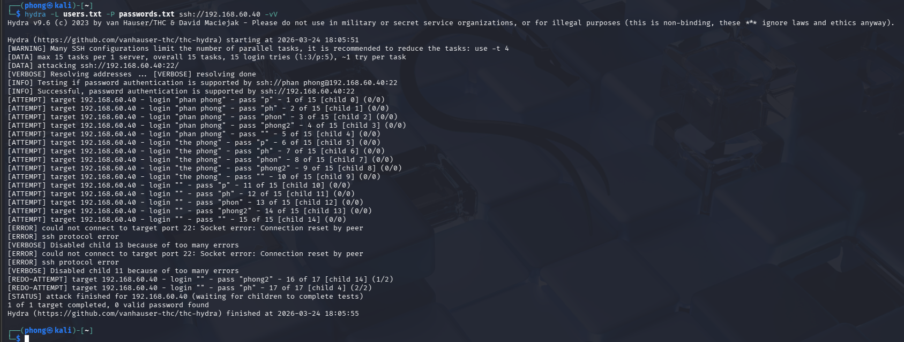

# Tính năng Active Respone

#### 1. Mục tiêu

Kiểm tra tính năng Active Respone của Wazuh bằng cách tấn công brute-force vào dịch vụ SSH trên ubuntu. Wazuh sẽ đọc log của hệ thống và tự động phát hiện tấn công dựa vào các rules đã cài sẵn và nó tự động ra lệnh cho tường lửa chặn kẻ tấn công.

#### 2. Cấu hình Active Respone tự động chặn ip kẻ tấn công bằng Firewall

- Mở file `/var/ossec/etc/ossec.conf` trên Wazuh server, đảm bảo đã có phần này (thường là mặc định)
    
    ```powershell
    <command>
        <name>firewall-drop</name>
        <executable>firewall-drop</executable>
        <timeout_allowed>yes</timeout_allowed>
      </command>
    ```
    
- Thêm chỉ thị kích hoạt Active Response, tìm đến thẻ `<active-response>`
    
    ```powershell
    <active-response>
        <command>firewall-drop</command>
        <location>local</location>
        <rules_id>5712, 5720</rules_id>
        <timeout>600</timeout>
      </active-response>
    ```
    
    - `location="local"`: Tức là con Agent nào đang bị tấn công thì ra lệnh cho tường lửa của chính con Agent đó chặn IP.
    - `rules_id`: Thay vì khóa mù quáng, hệ thống chỉ kích hoạt chặn nếu log vi phạm đúng bộ luật số `5712` hoặc `5720` (Bạn hoàn toàn có thể thay bằng các mức độ như `<level>10</level>` để hễ cảnh báo nào từ level 10 trở lên là tự động chặn).
- Lưu và khởi động lại Wazuh manager
    
    ```powershell
    sudo systemctl restart wazuh-manager
    ```
    

#### 3. Mô phỏng tấn công

- Sử dụng hydra từ máy kali tấn công vào máy ubuntu đã cài wazuh agent
    
    ```powershell
    hydra -L users.txt -P passwords.txt ssh://192.168.60.40 -vV
    ```
    
    
    

#### 4. Kiểm chứng trên Wazuh

- Vào module Threat hunting
    
    
    
    
    
- Các thông tin chi tiết
    
    