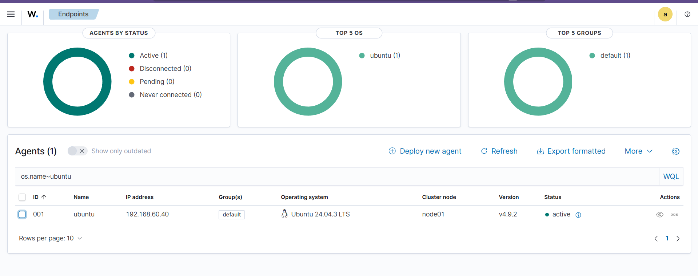

# Wazuh

[](https://wazuh.com/)

Đây là tài liệu hướng dẫn triển khai hệ thống SIEM bằng Wazuh và kiểm tra các tính năng bảo mật được tích hợp sẵn trên Wazuh.

## 1. Giới thiệu

Wazuh là một nền tảng bảo mật mã nguồn mở và miễn phí, kết hợp giữa XDR (Extended Detection and Response) và SIEM (Security Information and Event Management). Nó được sử dụng để giám sát an ninh, phát hiện các mối đe dọa, kiểm tra tính tuân thủ và phản ứng với các sự cố bảo mật trên các máy chủ, thiết bị đầu cuối và môi trường đám mây.

## 2. Kiến trúc

Hệ thống Wazuh hoạt động dựa trên sự phối hợp của 4 thành phần:

- Wazuh Indexer: Là một công cụ tìm kiếm và phân tích toàn văn, có khả năng mở rộng cao. Nó chịu trách nhiệm lưu trữ các cảnh báo do Wazuh server tạo ra và cung cấp khả năng tìm kiếm, phân tích dữ liệu theo thời gian thực.
- Wazuh Server: Đóng vai trò là "Bộ não phân tích". Nó nhận dữ liệu thô, giải mã, và đối chiếu với hàng ngàn luật (rules) bảo mật để xem có hành vi nào giống mã độc hay hacker không.
- Wazuh Dashboard: Giao diện người dùng web để khai thác, trực quan hóa và quản lý dữ liệu bảo mật. Nó cung cấp các biểu đồ, bảng điều khiển (dashboards) giúp quản trị viên dễ dàng theo dõi tình hình an ninh và phản hồi sự cố.
- Wazuh agents: Được cài đặt trên các thiệt bị đầu cuối như laptops, desktops, servers, cloud instances, hoặc virtual machines. Chúng cung cấp khả năng ngăn chặn, phát hiện và phản hồi các mối đe dọa. Chúng hoạt động trên các hệ điều hành như Linux, Windows, macOS, Solaris, AIX và HP-UX.

## 2. Các tính năng nổi bật

- Log Data Analysis: Phân tích log tập trung từ HĐH, Ứng dụng, Cloud, Firewall.
- File Integrity Monitoring (FIM): Báo động ngay lập tức nếu một file hệ thống quan trọng bị ai đó lén sửa đổi (rất hiệu quả để chống Ransomware).
- Vulnerability Detection: Tự động dò quét xem các máy tính trong mạng có đang cài phần mềm nào chứa lỗ hổng (CVE) chưa được vá hay không.
- Security Configuration Assessment (SCA): Đánh giá bảo mật của máy tính xem có cấu hình lỏng lẻo không (ví dụ: pass quá ngắn, mở port nguy hiểm).
- Active Response: Tự động thực hiện các hành động ứng phó khi phát hiện mối đe dọa, ví dụ như chặn địa chỉ IP, khóa tài khoản người dùng hoặc cách ly máy chủ bị nhiễm mã độc.

## 3. Triển khai

- Wazuh Quickstart: là gói cài đặt gồm cả Indexer, Server, Dashboard trên cùng một máy ảo Ubuntu Server.
- Wazuh Agent: cài ví dụ trên máy windows 10 và ubuntu.

### 1. Cài đặt Wazuh Quickstart trên ubuntu server

- Cập nhật hệ thống và tải file script cài đặt tự động `wazuh-install.sh`
  ```powershell
  sudo apt update && sudo apt upgrade -y
  curl -sO https://packages.wazuh.com/4.x/wazuh-install.sh
  ```
- Chạy script
  ```powershell
  sudo bash ./wazuh-install.sh -a
  ```

_Lưu ý: Quá trình này sẽ mất khoảng 10-15 phút. Hệ thống sẽ tự động cài Elasticsearch (Indexer), Wazuh Server và Kibana (Dashboard)._

- Khi chạy xong terminal sẽ ra một đoạn thông báo chứa username và password ngẫu nhiên.
- Đăng nhập giao diện Web Wazuh Dashboard bằng `https://<IP-của-Ubuntu-Server>` và đăng nhập bằng tài khoản đã cấp ở trên.

### 2. Cài đặt Wazuh Agent trên windows 10

- Trên giao diện Wazuh Dashboard → Server management → Endpoints Summary → Deploy new agent.
- Nhập IP của máy chủ Ubuntu vào ô `Wazuh server address`
- Hệ thống sẽ sinh ra lệnh cài đặt ở mục Install the agent, copy dòng lệnh này và chạy nó trên powershell của máy windows 10 (ở chế độ administrator).
- Sau khi cài xong, khởi chạy dịch vụ
  ```powershell
  NET START WazuhSvc
  ```

### 3. Cài đặt Wazuh Agent trên máy ubuntu

- Lấy lệnh cài đặt trên giao diện web và copy vào terminal của máy ubuntu tương tự như trên.
- Khởi động Agent, chạy lần lượt 3 lệnh sau để bật dịch vụ và cho phép nó chạy ngầm cùng hệ thống
  ```powershell
  sudo systemctl daemon-reload
  sudo systemctl enable wazuh-agent
  sudo systemctl start wazuh-agent
  ```
- Màn hình Dashboard đã hiển thị 1 agent từ ubuntu
  
- Dashboard của một agent cụ thể
  
- Các tính năng chính có trên Wazuh
  
- Trường Inventory data chứa thông tin của máy agent (như processes, network, OS & hardware,…)
  
- Tính năng Vunerability Detection
  
  - Có rất nhiều lỗ hổng trong hệ thống này
- Tích hợp MITTRE ATT&CK Framework
  

## 4. Kiểm tra một số tính năng

[Tính năng Active Respone](./Active_Respone/)

[Tính năng FIM](./FIM/)

[Tính năng SCA](./SCA/)
